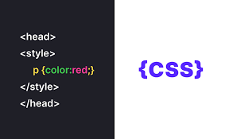

Textile Company Website - CSS Styling

Project Overview
This project focuses on applying CSS styling to the webpage created in the previous HTML project. The design is guided by a Figma file, where all the visual elements have been specified. My goal is to bring the webpage to life with a beautiful, professional look in line with the design specifications provided.

Tools & Resources
Figma: Design tool for viewing the final result.
Fonts: I may need to install the following fonts:
Source Sans Pro
Spin Cycle OT

Key Tasks:
CSS Layout: Implement the layout for each section (header, main content, footer) based on the Figma design.
Typography: Apply appropriate fonts and sizes. Make sure to download and include the necessary fonts.
Colors: Use color values from the Figma file to style backgrounds, text, and borders.
Images & Icons: Ensure all images and icons match the Figma design and are positioned properly.
Buttons & Interactivity: Style buttons, links, and other interactive elements for a polished user experience.
Responsive Design: Make sure the design is responsive across different screen sizes (desktop, tablet, mobile).
Cross-Browser Compatibility: Test the website on different browsers (Chrome, Firefox, Safari) to ensure consistency.